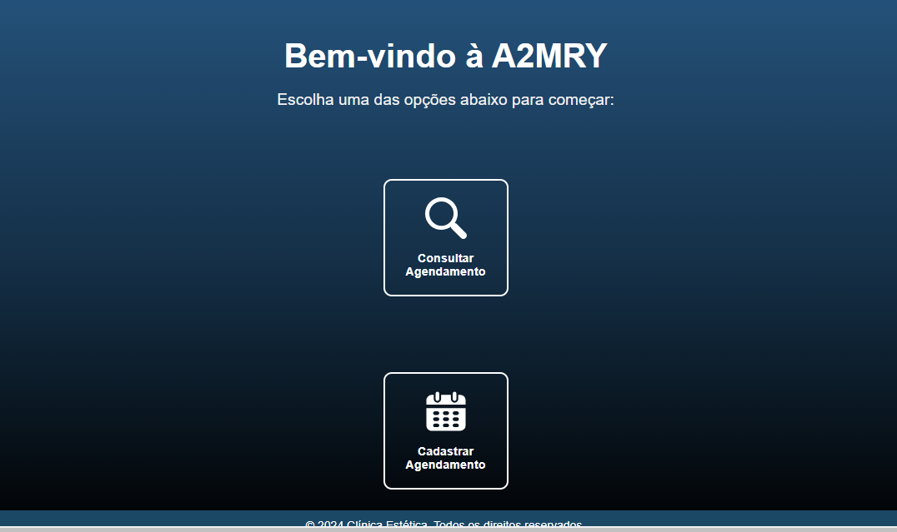
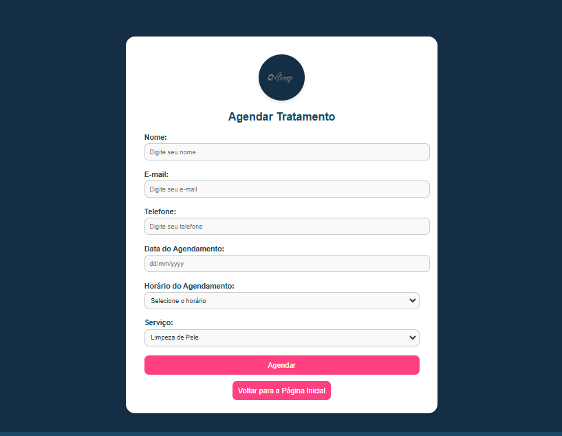

# A2MRY - Sistema de Agendamentos

**Bem-vindo ao projeto A2MRY!** Este sistema foi desenvolvido para atender clínicas estéticas e outros negócios que necessitam de uma plataforma de agendamentos simples e eficiente. 🚀

---

## 🌟 **Funcionalidades Principais**

- **Agendamentos**: Interface intuitiva para clientes marcarem seus horários.

- **Gesão dos Agendamentos**: Acesse o uma lista com os agendamentos criados.

---

## 🛠️ **Tecnologias Utilizadas**

- **Frontend**:  
  - HTML5, CSS3
  
- **Backend**:  
  - Linguagem: PHP  
  - Banco de Dados: MySQL  

---

## 📸 **Capturas Principal**

1. **Tela de Login:**
   

2. **Tela de Cadastro:**
   
   

3. **Página de Agendamentos:**
   

---

## 🚀 **Como Executar o Projeto**

### 1. Clonar o Repositório
```bash
git clone https://github.com/matheusmcoutinho/A2MRY.git
cd A2MRY
